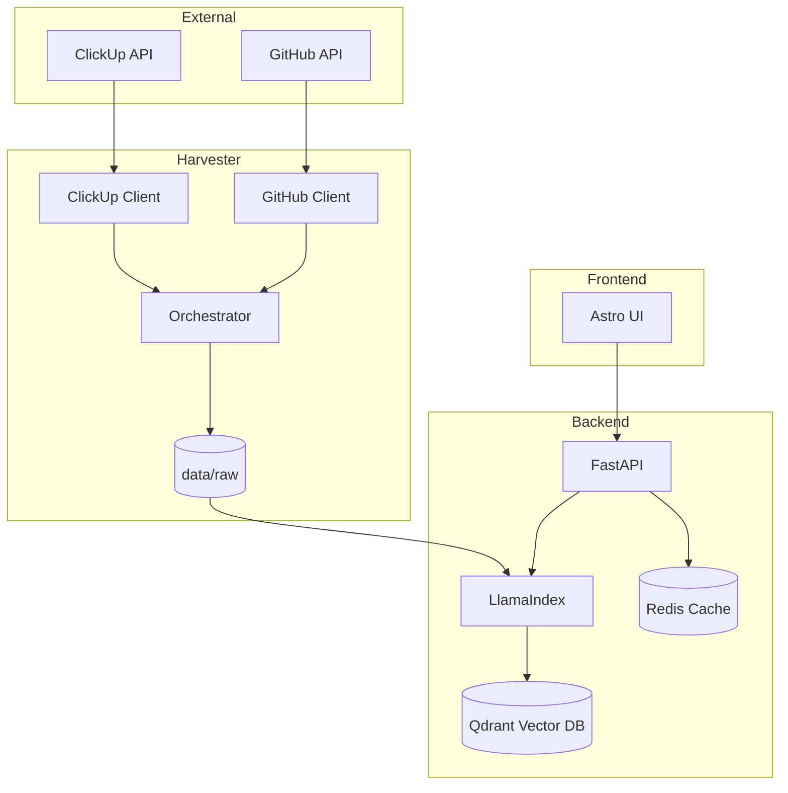

# Klippy

Enterprise Search Aggregator and RAG system for ClickUp and GitHub.

## Architecture and Workflow

Klippy operates as a data pipeline that transforms siloed company knowledge into a searchable semantic index. The system follows a layered architecture to ensure separation of concerns and data integrity.



### Data Flow

1.  **Harvesting**: The Harvester runs parallel threads to discover and fetch data. It maps ClickUp tasks, docs, and pages, and GitHub repositories, commits, and READMEs.
2.  **Normalization**: Fetched data is converted into structured Markdown files. Metadata is preserved using YAML frontmatter to facilitate downstream filtering and attribution.
3.  **Storage**: Files are saved to a hierarchical data directory (`data/raw`).
4.  **Retrieval**: The Backend monitors the data directory. When a query is received, it performs a hybrid search across the vector store.
5.  **Synthesis**: The system retrieves relevant context chunks and passes them to an LLM to generate a natural language response with citations.
6.  **Optimization**: Frequent queries are served from a Redis cache, and all RAG operations are traced via Arize Phoenix for quality monitoring.

## Setup and Usage

### Prerequisites
- Docker and Docker Compose
- Access to ClickUp and GitHub APIs
- OpenAI-compatible LLM endpoint

### Launch
```bash
docker compose up --build
```

### Access
- Search Interface: http://localhost:4321
- API Documentation: http://localhost:8000/docs
- Observability UI: http://localhost:6006

## Development

### Harvester
Python-based engine using `uv` for dependency management and `pytest` for verification.
```bash
cd harvester
uv run pytest
```

### Backend
FastAPI service using LlamaIndex for RAG orchestration.
```bash
cd backend
uv run pytest
```
