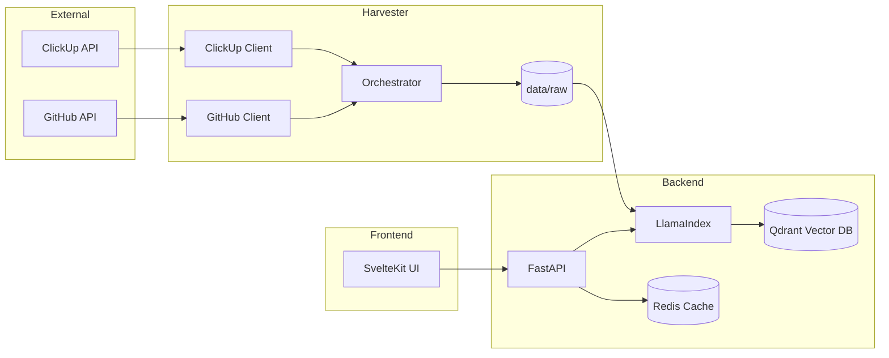

# Klippy

Enterprise Search Aggregator and RAG system for ClickUp and GitHub.

## Capabilities

- Natural language search across ClickUp tasks and GitHub documentation
- Real-time streaming responses via Server-Sent Events (SSE)
- Configurable search breadth (Top K) and precision (Similarity Threshold) directly in the UI
- Incremental sync — only fetches data created or modified since the last run
- Hybrid retrieval — semantic similarity combined with metadata filtering (source, date, type)
- Synthesised answers with clickable citations back to the original ClickUp task or GitHub file
- Configurable LLM and embedding model (OpenAI-compatible APIs or local HuggingFace models)

## Architecture and Workflow

Klippy operates as a data pipeline that transforms siloed company knowledge into a searchable semantic index.



### Data Pipeline

1. **Harvesting**: The Harvester fetches data from ClickUp and GitHub and writes Markdown files to `data/raw/`.
2. **Normalisation**: Each item is converted to Markdown with YAML frontmatter containing metadata (source, type, URL, author, etc.).
3. **Indexing**: The Backend uses an `IngestionPipeline` with Redis caching. It only re-processes files whose content hash has changed.
4. **Retrieval**: Performs semantic + metadata filtered search across Qdrant.
5. **Synthesis**: Synthesises answers using the configured LLM with citations to original sources.

### What gets harvested

**ClickUp**
- Tasks (incremental — only fetches updates since last sync, tracked in `data/state.json`)
- Docs and pages — unfiltered workspace sweep with BFS discovery of all nested sub-docs and deep pages via the page listing API

**GitHub**
- All Markdown files (`.md`) from every configured repository, fetched recursively via the Git Trees API

## Services

| Service           | Technology           | Description                                       |
| :---------------- | :------------------- | :------------------------------------------------ |
| **backend**       | FastAPI / LlamaIndex | RAG orchestration and query API                   |
| **harvester**     | Python / uv          | Data ingestion worker (runs on-demand via Docker) |
| **qdrant**        | Qdrant               | Vector database for embeddings and metadata       |
| **redis**         | Redis                | Caching for ingestion pipeline and API responses  |
| **redis-insight** | Redis Insight        | Web interface for browsing Redis data             |
| **phoenix**       | Arize Phoenix        | Observability and RAG tracing                     |

## Operational Guide

### 1. Launching the Infrastructure

```bash
docker compose up -d
```

On Linux with an NVIDIA GPU, include the GPU override to enable CUDA acceleration for embeddings:

```bash
docker compose -f docker-compose.yml -f docker-compose.gpu.yml up -d
```

> Requires [`nvidia-container-toolkit`](https://docs.nvidia.com/datacenter/cloud-native/container-toolkit/install-guide.html) on the host.

### 2. Running the Frontend

The SvelteKit frontend is decoupled from Docker for faster development:

```bash
cd frontend
pnpm install
pnpm dev
```

Access the interface at [http://localhost:5173](http://localhost:5173).

### 3. Harvesting Data

Run both ClickUp and GitHub harvesters:

```bash
docker compose run --rm harvester uv run python main.py --all
```

Run only one source:

```bash
docker compose run --rm harvester uv run python main.py --clickup
docker compose run --rm harvester uv run python main.py --github
```

Harvest ClickUp docs and pages only (skips tasks and GitHub):

```bash
docker compose run --rm harvester uv run python main.py --docs-only
```

Force a full re-harvest (ignores saved task sync state):

```bash
docker compose run --rm harvester uv run python main.py --all --force
```

### 4. Updating the Index

Trigger re-indexing after a harvest:

```bash
# Ingest all documents
curl -X POST http://localhost:8000/ingest

# Ingest all documents and extract metadata (questions and keywords)
curl -X POST http://localhost:8000/ingest -d '{"extract_questions": true, "extract_keywords": true}'

# Force re-index (clears and rebuilds the Qdrant collection)
curl -X POST http://localhost:8000/ingest -d '{"force": true}'

# Ingest a random sample for testing
curl -X POST http://localhost:8000/ingest -d '{"limit": 100}'

# Fetch random sample questions
curl http://localhost:8000/questions?n=5
```

### 5. Observability and Monitoring

| Interface | URL |
| :--- | :--- |
| Search UI | http://localhost:5173 |
| API docs | http://localhost:8000/docs |
| Arize Phoenix (RAG traces) | http://localhost:6006 |
| Redis Insight | http://localhost:5540 |

## Configuration

All configuration is via environment variables in a `.env` file at the project root.

### Backend

| Variable | Description | Default |
| :--- | :--- | :--- |
| `LLM_API_KEY` | API key for the LLM provider | — |
| `LLM_BASE_URL` | OpenAI-compatible API base URL | `https://api.openai.com/v1` |
| `LLM_MODEL` | Model name | `gpt-4-turbo-preview` |
| `LLM_CONTEXT_WINDOW` | Maximum context window for the LLM | `3900` |
| `EMBED_MODEL` | Embedding model name or `local:<hf-model-id>` | `jinaai/jina-embeddings-v5-text-small` |
| `EMBED_DEVICE` | Device for local embeddings (`cpu`, `mps`, `cuda`). Auto-detected if unset. | auto |

### Harvester

| Variable | Description | Example |
| :--- | :--- | :--- |
| `CLICKUP_API_KEY` | ClickUp personal API token | — |
| `CLICKUP_WORKSPACE_ID` | Workspace (team) ID | `12345678` |
| `CLICKUP_IGNORE_SPACES` | Comma-separated space names to skip | `Archive,Sandbox` |
| `GITHUB_TOKEN` | GitHub personal access token | — |
| `GITHUB_ORGS` | Comma-separated GitHub org names to harvest | `my-org` |
| `GITHUB_USERS` | Comma-separated GitHub usernames to harvest | `my-user` |
| `GITHUB_IGNORE_REPOS` | Comma-separated repos to skip (full name) | `org/repo1,org/repo2` |

## Development

### Tests

```bash
# Harvester
cd harvester && uv run pytest

# Backend
cd backend && uv run pytest
```
