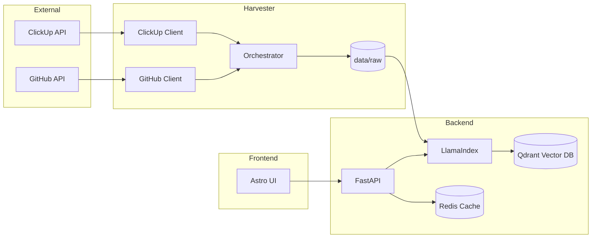

# Klippy

Enterprise Search Aggregator and RAG system for ClickUp and GitHub.

## Architecture and Workflow

Klippy operates as a data pipeline that transforms siloed company knowledge into a searchable semantic index.



### Data Pipeline

1.  **Harvesting**: The Harvester runs parallel threads to discover and fetch data.
    - **ClickUp**: Discovers all spaces (filtering ignored ones), folders, and lists. Incremental sync for tasks and full sync for docs/pages.
    - **GitHub**: Discovers all repositories for specified orgs/users. Incremental sync for commits and full sync for READMEs.
2.  **Normalization**: Data is converted to Markdown with YAML frontmatter containing metadata (IDs, URLs, authors, timestamps).
3.  **Storage**: Files are saved to `data/raw/`. Sync state is tracked in `data/state.json`.
4.  **Indexing**: The Backend uses an `IngestionPipeline` with Redis caching. It only re-processes files if their content hash has changed.
5.  **Retrieval**: Performs hybrid search (semantic + metadata) across Qdrant.
6.  **Synthesis**: Synthesizes answers using the selected LLM, providing citations to original sources.

## Services

| Service       | Technology           | Description                                        |
| :------------ | :------------------- | :------------------------------------------------- |
| **backend**   | FastAPI / LlamaIndex | RAG Orchestration and Query API                    |
| **harvester** | Python / uv          | Data ingestion worker (runs on-demand or via cron) |
| **qdrant**    | Qdrant               | Vector database for embeddings and metadata        |
| **redis**     | Redis                | Caching for LLM responses and ingestion pipeline   |
| **redis-insight** | Redis Insight    | Web interface for browsing Redis data              |
| **phoenix**   | Arize Phoenix        | Observability and RAG tracing                      |
| **frontend**  | Astro                | Web-based search interface                         |

## Configuration

Environment variables are managed in the `.env` file.

### LLM Settings

- `LLM_API_KEY`: API key for your LLM provider.
- `LLM_BASE_URL`: Base URL for OpenAI-compatible endpoints (e.g., vLLM, Ollama).
- `LLM_MODEL`: The specific LLM model name (e.g., `gpt-4`).
- `EMBED_MODEL`: The specific embedding model name (e.g., `text-embedding-3-small`).

### ClickUp Settings

- `CLICKUP_API_KEY`: Personal API Key.
- `CLICKUP_WORKSPACE_ID`: Team/Workspace ID to harvest.
- `CLICKUP_IGNORE_SPACES`: Comma-separated list of space names to skip.

### GitHub Settings

- `GITHUB_TOKEN`: Fine-grained PAT with `metadata:read` and `contents:read` permissions.
- `GITHUB_ORGS`: Comma-separated list of organizations to harvest.
- `GITHUB_USERS`: Comma-separated list of users to harvest.

## Operational Guide

Both harvesting and indexing are manual processes. They do not run automatically on startup to allow for better control over resource usage.

### 1. Launching the Infrastructure
Start the database and API services:

```bash
docker compose up -d
```

### 2. Harvesting Data
To trigger a manual incremental sync:

```bash
docker compose --profile manual run --rm harvester uv run python main.py --all
```

To force a full re-harvest (ignoring saved state):

```bash
docker compose --profile manual run --rm harvester uv run python main.py --all --force
```

### 3. Updating the Index
The backend provides two ways to index the harvested data.

**Via CLI (Recommended for testing with limits):**
```bash
# Ingest all documents
docker compose run --rm backend uv run python main.py --ingest

# Ingest a random sample of 100 documents for testing
docker compose run --rm backend uv run python main.py --ingest --limit 100
```

**Via API:**
```bash
# Ingest all
curl -X POST http://localhost:8000/ingest -H "Content-Type: application/json" -d '{"limit": null}'

# Ingest a random sample
curl -X POST http://localhost:8000/ingest -H "Content-Type: application/json" -d '{"limit": 50}'
```

### 4. Observability and Monitoring

- **Search Interface:** http://localhost:4321
- **API Documentation:** http://localhost:8000/docs
- **Arize Phoenix (RAG Traces):** http://localhost:6006
- **Redis Insight (Cache Browser):** http://localhost:5540

## Development

### Harvester

```bash
cd harvester
uv run pytest
```

### Backend

```bash
cd backend
uv run pytest
```
