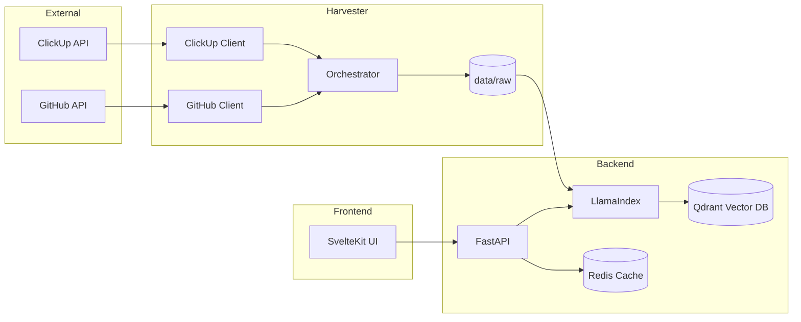

# Klippy

Enterprise Search Aggregator and RAG system for ClickUp and GitHub.

## Architecture and Workflow

Klippy operates as a data pipeline that transforms siloed company knowledge into a searchable semantic index.



### Data Pipeline

1.  **Harvesting**: The Harvester runs parallel threads to discover and fetch data from ClickUp and GitHub.
2.  **Normalization**: Data is converted to Markdown with YAML frontmatter containing metadata.
3.  **Storage**: Files are saved to `data/raw/`. Sync state is tracked in `data/state.json`.
4.  **Indexing**: The Backend uses an `IngestionPipeline` with Redis caching. It only re-processes files if their content hash has changed.
5.  **Retrieval**: Performs hybrid search (semantic + metadata) across Qdrant.
6.  **Synthesis**: Synthesizes answers using the selected LLM, providing citations to original sources.

## Services

| Service       | Technology           | Description                                        |
| :------------ | :------------------- | :------------------------------------------------- |
| **backend**   | FastAPI / LlamaIndex | RAG Orchestration and Query API                    |
| **harvester** | Python / uv          | Data ingestion worker (runs on-demand via Docker)  |
| **qdrant**    | Qdrant               | Vector database for embeddings and metadata        |
| **redis**     | Redis                | Caching for LLM responses and ingestion pipeline   |
| **redis-insight** | Redis Insight    | Web interface for browsing Redis data              |
| **phoenix**   | Arize Phoenix        | Observability and RAG tracing                      |

## Operational Guide

### 1. Launching the Infrastructure
Start the core services using Docker:

```bash
docker compose up -d
```

### 2. Running the Frontend
The SvelteKit frontend is decoupled from Docker for faster development. Run it natively:

```bash
cd frontend
pnpm install
pnpm dev
```
Access the interface at [http://localhost:5173](http://localhost:5173).

### 3. Harvesting Data
To trigger a manual incremental sync:

```bash
docker compose --profile manual run --rm harvester uv run python main.py --all
```

To force a full re-harvest (ignoring saved state):

```bash
docker compose --profile manual run --rm harvester uv run python main.py --all --force
```

### 4. Updating the Index
Trigger a re-index after a harvest:

```bash
# Ingest all documents
docker compose run --rm backend uv run python main.py --ingest

# Ingest a random sample of 100 documents for testing
docker compose run --rm backend uv run python main.py --ingest --limit 100
```

### 5. Observability and Monitoring

- **Search Interface:** http://localhost:5173
- **API Documentation:** http://localhost:8000/docs
- **Arize Phoenix (RAG Traces):** http://localhost:6006
- **Redis Insight (Cache Browser):** http://localhost:5540

## Development

### Harvester
```bash
cd harvester
uv run pytest
```

### Backend
```bash
cd backend
uv run pytest
```
